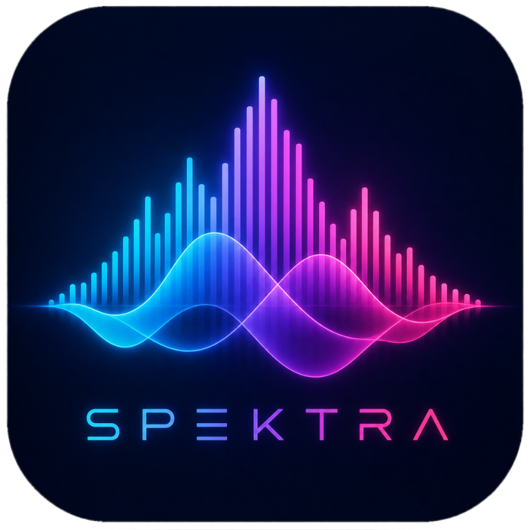

  

  
  
  
  
  
  

# Spektra

A desktop audio spectrum analyzer: drop in an audio file, see its spectrogram,
compare encodes side by side, and get an automated "is this really lossless?"
verdict.

## Features

- Progressive spectrogram with time/frequency rulers and dB legend
- Automated bandwidth verdict: detects a lossy low-pass cutoff and reports
  Lossless / Suspicious / Lossy with a likely codec/bitrate guess
- Zoom & pan: wheel = time zoom, Shift+wheel = frequency zoom, drag = pan,
  double-click = reset (zoomed spans re-render sharply via ffmpeg segment decode)
- Cursor readout (time, frequency, dB) and a toggleable average-spectrum overlay
  (peak-hold + time-average)
- Preferences: FFT size, window function (Hann/Hamming/Blackman/Blackman-Harris),
  color palette (Magma/Viridis/Inferno/Grayscale), dynamic-range floor, and a
  linear or logarithmic frequency axis
- Save the spectrogram to PNG (Ctrl+S) or copy it to the clipboard (Ctrl+Shift+C)
- Tabs: open many files at once (dialog, drag-drop, or CLI args)
- Per-channel or mixdown analysis for multichannel files
- Recent files + window placement remembered across runs
- Compare two files: stacked spectrograms on a shared time axis, synced zoom/pan,
  manual + automatic (cross-correlation) time alignment, A/B flip, and a signed
  A−B difference view (diverging colormap) with a numeric diff score
- Null test (time-domain A−B residual) and drift detection for misaligned encodes
- Integrity check: flags corrupt frames, missing data (interior digital silence),
  and truncated (partially downloaded) files, in the app (Ctrl+I) or the CLI
- Loudness & dynamics: integrated LUFS, loudness range, true peak, crest factor,
  and a clipping hint (EBU R128 via ffmpeg), in the app (Ctrl+L) or the CLI

## Keyboard shortcuts

| Shortcut | Action |
| --- | --- |
| `Ctrl+O` | Open audio files |
| `Ctrl+W` · `Ctrl+Tab` | Close tab · switch tabs (Shift to reverse) |
| `Ctrl+S` · `Ctrl+Shift+C` | Save the spectrogram to PNG · copy it to the clipboard |
| `Ctrl+E` · `Ctrl+R` | Preferences · toggle the average-spectrum overlay |
| `Ctrl+I` · `Ctrl+L` | Check integrity · measure loudness (LUFS) |
| Wheel · `Shift`+Wheel | Zoom time · zoom frequency |
| Drag · Double-click | Pan · reset the view |
| `T` · `D` · `Esc` | Compare view: flip A/B · show difference · back to both |

Check for a newer release any time from **Help → Check for Updates**. Spektra
never updates itself; it only tells you when a newer release exists and links to
it. You can also enable a quiet once-a-day check on startup in Preferences.

## Download

Grab the latest build from the **[releases page](https://github.com/rarepops/Spektra/releases/latest)**:

- `Spektra-<version>-Setup.msi`: the Windows installer for the desktop app (can add `spektra` to your PATH).
- `Spektra-<version>-win-x64.zip`: the portable desktop app, no install needed.
- `spektra-cli-<version>-<os>.zip`: the command-line tool (Windows, Linux, macOS).

Spektra isn't code-signed yet, so Windows SmartScreen may show **"Windows
protected your PC"** or an **Unknown Publisher** prompt. That's expected for an
unsigned open-source build, not a sign of a problem: choose **More info → Run
anyway** to continue. To verify a download first, check it against the
`SHA256SUMS.txt` published with each release:

    # Windows (PowerShell)
    (Get-FileHash .\Spektra-<version>-Setup.msi -Algorithm SHA256).Hash

    # Linux / macOS
    sha256sum -c SHA256SUMS.txt

## Requirements

- Windows (primary target; Avalonia keeps Linux/macOS possible)
- [ffmpeg + ffprobe](https://ffmpeg.org/), found via the app folder,
  `%LOCALAPPDATA%\Spektra\ffmpeg`, or `PATH`. If missing, Spektra offers a
  one-click download. ffmpeg is invoked as a separate process and is not
  linked or bundled.

## Build & run

    dotnet run --project src/Spektra.App -- <optional-audio-file>

Compare two files directly (also available in-app via File → Compare…):

    dotnet run --project src/Spektra.App -- --compare <fileA> <fileB> [--auto] [--mode diff]

## Command line

Spektra ships a small cross-platform companion CLI (`spektra`) that reuses the
analysis engine. It writes to stdout and exits 1 when anything looks lossy or corrupt:

    spektra report <file|folder> ...   Bandwidth verdict per file.
    spektra scan <folder>              Compact bandwidth scan of a library.
    spektra check <file|folder> ...    Integrity check (corruption / missing data).
    spektra audit <file|folder> ...    Bandwidth + integrity together.
    spektra loudness <file|folder> ... Loudness (LUFS), true peak, and dynamics.

Add `--json` or `--csv` to any command for a machine-readable report:

    spektra scan Music --csv > library.csv

(`--report` / `--scan` are accepted too.) Build it with
`dotnet publish src/Spektra.Cli -c Release`.

## Test

    dotnet test

## License

[PolyForm Strict 1.0.0](LICENSE.md). © Rares (rarepops).
