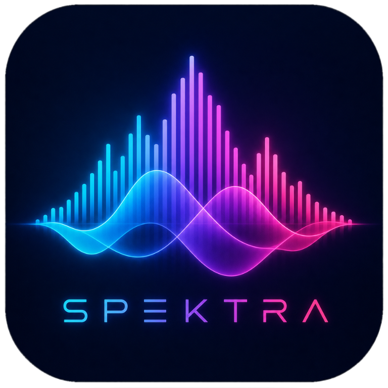
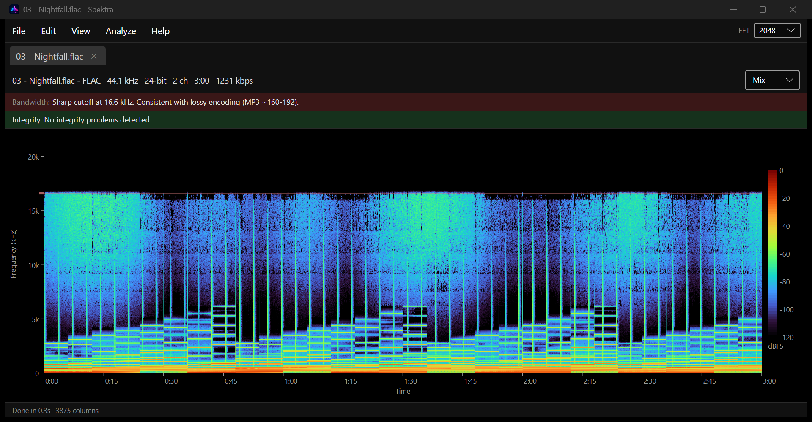
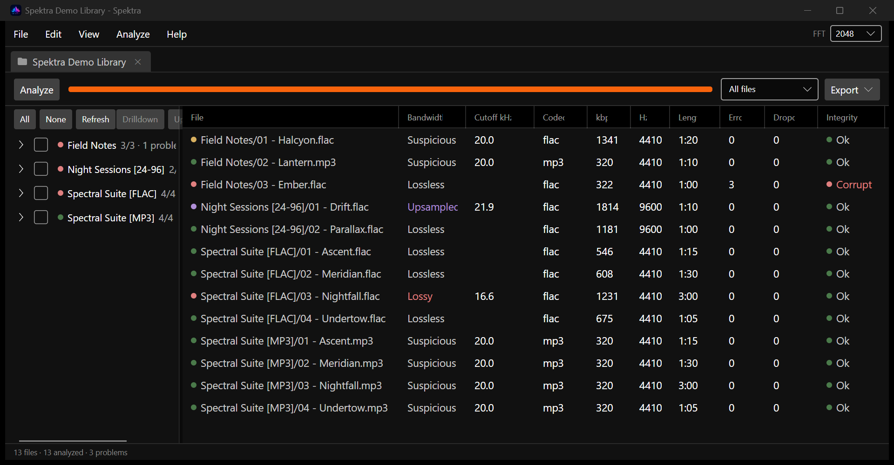
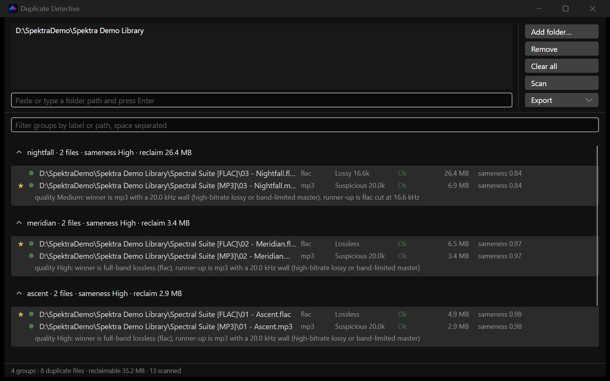
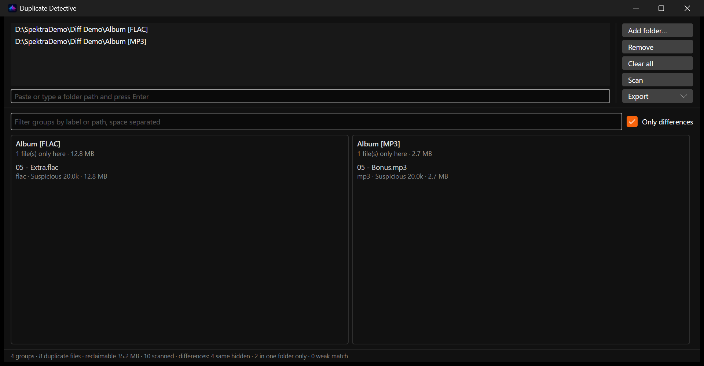
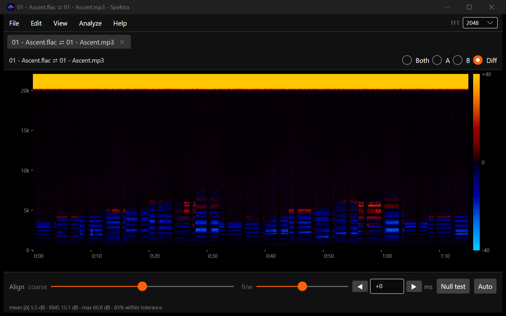

  

  
  
  <!-- event=push keeps manual 0.0.0-dev test builds out of the release badge; only tag pushes count. -->
  
  
  
  
  
  
  

  
  

# Spektra

A desktop audio spectrum analyzer: drop in a file to see its spectrogram, drop in a folder to browse a library and audit the files you pick in a live grid, compare encodes side by side, and get an automated "is this really lossless?" verdict.

  

## Features

- Progressive spectrogram with time/frequency rulers and dB legend
- Automated bandwidth verdict: detects a lossy low-pass cutoff and reports Lossless / Suspicious / Lossy with a likely codec/bitrate guess
- Upsampling detection: a hi-res file whose real bandwidth stops at a lower standard rate (a 96 kHz container holding 22.05 kHz of content) is flagged Upsampled, naming the likely true source rate
- Transcode-aware problems: an honest lossy file is not a problem; the audit flags lossy content hiding in a lossless container, or an mp3/aac whose cutoff sits far below what its bitrate should deliver
- Compilation-aware: a transcoded track hidden inside a compilation, DJ mix, or continuous set is reported Mixed with the suspect stretch's timestamps, instead of being masked by the genuine tracks around it
- Export report: save the bandwidth + integrity audit for the current file or a whole folder as CSV/JSON (File → Export Report… / Export Folder Report…)
- Folder browse-and-audit: drop a folder (or pass it on the command line) for an instant browse tree with any cached verdicts already shown, check the files or folders you want and press Analyze to audit just those into a sortable grid with byte-weighted progress, a remaining-time estimate, and a tiered severity filter (all / suspect + worse / problems only), Drilldown to focus the grid on one subtree, Refresh (Ctrl+F5) to re-read the folder from disk without analyzing anything (new files appear unchecked, deleted ones vanish, the boxes you ticked stay ticked), all backed by a persistent cache shared with the CLI; right-click any row, file, or folder for verbs (open, re-analyze fresh, analyze a folder, copy path, reveal), with multi-row selection honored
- Folder-aware Analyze menu: in a folder tab the menu's folder commands name the folder they would act on (the drilldown scope once you have drilled in), Analyze queues that whole scope through the cache with your checkboxes untouched, and the Duplicate Detective and Folder Manifest launchers open already pointed at it; in any other tab they stay the plain global launchers, and the two track-only checks grey out where there is no track
- Duplicate Detective: find duplicate songs across folders by acoustic fingerprint (renames and format changes cannot hide a copy), grouped with confidence levels and the best copy starred; filter big result sets by label or path, jump straight to a side-by-side comparison against the group's winner, and copy the loser paths for use elsewhere; tick Only differences to turn the same scan into a folder diff, one column per folder holding just the tracks that side alone has; view-only, with HTML/CSV/JSON export
- Folder Manifest: instantly list everything inside a folder as a tree with honest type chips (cached audio verdicts included) and per-folder composition rollups with recursive byte totals; an address bar swaps folders in place, Rescan (or F5) lists the current folder again to pick up files added or removed on disk, columns resize and persist, huge listings cancel, and any folder hops into the audit with one click; view-only, filterable by extension, with HTML/CSV/JSON export of exactly what is shown (also scriptable as `spektra-cli manifest`)
- Zoom & pan: wheel = time zoom, Shift+wheel = frequency zoom, drag = pan, double-click = reset (zoomed spans re-render sharply via ffmpeg segment decode)
- Cursor readout (time, frequency, dB) and a toggleable average-spectrum overlay (peak-hold + time-average)
- Preferences: FFT size, window function (Hann/Hamming/Blackman/Blackman-Harris), color palette (Turbo by default, plus Magma/Inferno/Plasma/Viridis/Cividis/Grayscale, mono phosphor ramps, and custom palettes as JSON files with even anchors or stops pinned to a dB level), a tightness curve for how fast quiet detail fades to black, dynamic-range floor, a linear or logarithmic frequency axis, and how much analyzed audio stays in memory so a file you come back to shows at once
- Save the spectrogram to PNG (Ctrl+S) or copy it to the clipboard (Ctrl+Shift+C)
- Tabs: open many files at once (dialog, drag-drop, or CLI args)
- Per-channel or mixdown analysis for multichannel files
- Recent files + window placement remembered across runs, with a Start new / Keep last preference deciding whether tabs, scan folders, and the manifest folder come back on launch
- Compare two files: stacked spectrograms on a shared time axis, synced zoom/pan, manual + automatic (cross-correlation) time alignment, A/B flip, and a signed A−B difference view (diverging colormap) with a numeric diff score
- Null test (time-domain A−B residual) and drift detection for misaligned encodes
- Integrity check: flags corrupt frames, missing data (interior digital silence), and truncated (partially downloaded) files; runs automatically on every file opened in the app (on by default, Preferences toggle; Ctrl+I hides/shows the results) and on demand in the CLI; silent gaps and the missing tail are marked on a lane along the time axis
- Loudness & dynamics: integrated LUFS, loudness range, true peak, crest factor, and a clipping hint (EBU R128 via ffmpeg), in the app (Ctrl+L) or the CLI

## Screenshots

Audit a whole library at once. The tree shows what is where, the grid streams a verdict per file as it lands, and the coloured dots separate a bandwidth problem from an integrity one.

  

Duplicate Detective matches by acoustic fingerprint, so the same song is found again across formats and filenames, with the best copy starred.

  

Ticking Only differences turns the same scan into a folder diff. Every track the scan is confident both folders hold disappears, and each folder gets a column of what only it has, so two copies of a library answer "what is missing from which side" in one pass. A folder with nothing unique still gets a column saying so, because that is an answer too.

  

Compare two encodes on a shared time axis, aligned automatically, with a signed A minus B difference view showing exactly what the smaller file threw away.

  

## Keyboard shortcuts

These are the defaults; all of them except `F1` can be changed (see [Changing the shortcuts](#changing-the-shortcuts) below). **Help → Controls** (`F1`) always shows the keys actually in force, which is the list to trust if you have remapped anything.

| Shortcut | Action |
| --- | --- |
| `Ctrl+O` · `Ctrl+Shift+O` | Open audio files · open a folder to audit |
| `Ctrl+W` · `Ctrl+Tab` | Close tab · switch tabs (Shift to reverse) |
| `Ctrl+S` · `Ctrl+Shift+C` | Save the spectrogram to PNG · copy it to the clipboard |
| `Ctrl+E` · `Ctrl+R` | Preferences · toggle the average-spectrum overlay |
| `Ctrl+I` · `Ctrl+L` | Check integrity · measure loudness (press again to hide/show) |
| Wheel · `Shift`+Wheel | Zoom time · zoom frequency |
| Drag · Double-click | Pan · reset the view |
| `T` · `D` · `A` · `Esc` | Compare view: flip A/B · difference · auto-align · back to both |
| `Ctrl+D` · `Ctrl+Shift+S` | Compare two files · export the current file's report |
| `Ctrl+0` · `Ctrl+1`..`Ctrl+9` | Reset the view · jump to tab N |
| `Ctrl+Up` / `Ctrl+Down` · `F5` | Previous / next channel · reload the file or analyze the folder's checked files (`Shift+F5` = ignore the cache) |
| `Ctrl+Left` / `Ctrl+Right` | Previous / next file in the folder, in the same tab |
| `Ctrl+F5` | Folder tab: re-read the folder from disk, keeping your ticked checkboxes |
| `Ctrl+H` | Toggle the crosshair (cursor line + readout) |

### Changing the shortcuts

Put a `keybindings.json` beside your settings in `%APPDATA%\Spektra`, listing only the commands you want to move, and restart Spektra:

    {
      // browser-style navigation between files
      "next-file": "Alt+Right",
      "previous-file": "Alt+Left",
      "save-image": ""
    }

An empty string unbinds a command. Comments and a trailing comma are allowed, since this file is meant to be edited by hand. Modifiers are `Ctrl`, `Shift` and `Alt` in any order and any casing, and the key is whatever you would call it: `S`, `F5`, `0`, `Left`, `Esc`, `Tab`, `PageUp`.

Binding a command to a key another command already uses is allowed, and the other command loses that key: that is what remapping means, and leaving both bound would fire two things on one press. Swapping two commands' keys therefore works as written. Spektra never writes this file, and never fails over it: anything it cannot understand is listed in the Controls window and skipped, leaving that command's default alone, so a typo costs one line rather than your keyboard.

The command names are:

    open-files        open-folder       close-tab         next-tab
    previous-tab      preferences       save-image        copy-image
    export-report     reset-view        toggle-spectrum   toggle-crosshair
    next-channel      previous-channel  next-file         previous-file
    check-integrity   measure-loudness  reload            reload-fresh
    refresh-folder    compare           compare-flip      compare-diff
    compare-both      compare-align

`F1` is deliberately not in that list. It opens the window documenting every other key, so it stays put. The `Ctrl+1`..`Ctrl+9` tab jumps are positional rather than a command each, and are also fixed.

Check for a newer release any time from **Help → Check for Updates**. Spektra never updates itself behind your back: it tells you when a newer release exists, links to it, and on request downloads the right file for your machine (the installer for an installed copy, the portable zip otherwise) into your Downloads folder, checking it against the release's `SHA256SUMS.txt` before offering to install it. You can also enable a quiet once-a-day check on startup in Preferences.

## Documentation

- **[GUI guide](docs/gui.md)**: inspecting files, verdict banners, compare workflows, integrity/loudness checks, report export.
- **[CLI guide](docs/cli.md)**: every command with sample output, JSON/CSV reports, exit codes, and scripting examples.

## Download

Grab the latest build from the **[releases page](https://github.com/rarepops/Spektra/releases/latest)**:

- `Spektra-<version>-Setup.msi`: the Windows installer. It installs the desktop app and the command-line tool together, and its Options page has a checkbox for putting both on your PATH (`spektra` opens the app, `spektra-cli` runs the command-line tool) and one for adding Spektra to the Explorer right-click menu.
- `Spektra-<version>-Setup.zip`: the same installer inside a zip, for a browser or mail filter that refuses a bare `.msi` download. Extract and run it; the extracted file matches the `Setup.msi` line in `SHA256SUMS.txt`.
- `Spektra-<version>-win-x64.zip`: the portable desktop app, no install needed.
- `spektra-cli-<version>-<os>.zip`: the command-line tool on its own (Windows, Linux, macOS), for machines that do not want the app.

Spektra isn't code-signed yet, so Windows SmartScreen may show **"Windows protected your PC"** or an **Unknown Publisher** prompt. That's expected for an unsigned open-source build, not a sign of a problem: choose **More info → Run anyway** to continue. To verify a download first, check it against the `SHA256SUMS.txt` published with each release:

    # Windows (PowerShell)
    (Get-FileHash .\Spektra-<version>-Setup.msi -Algorithm SHA256).Hash

    # Linux / macOS
    sha256sum -c SHA256SUMS.txt

The MSI build's uninstaller removes Spektra and its downloaded copy of ffmpeg. Your settings, custom palettes, and the analysis cache in `%APPDATA%\Spektra` are kept unless you tick "Also remove settings, palettes, and the analysis cache" while uninstalling.

## Requirements

- Windows (primary target; Avalonia keeps Linux/macOS possible)
- [ffmpeg + ffprobe](https://ffmpeg.org/), found via the app folder, `%LOCALAPPDATA%\Spektra\ffmpeg`, or `PATH`. If missing, Spektra offers a one-click download. ffmpeg is invoked as a separate process and is not linked or bundled.

## Build & run

    dotnet run --project src/Spektra.App -- <optional-audio-file>

Compare two files directly (also available in-app via File → Compare…):

    dotnet run --project src/Spektra.App -- --compare <fileA> <fileB> [--auto] [--mode diff]

## Command line

Spektra ships a small cross-platform companion CLI (`spektra-cli`) that reuses the analysis engine. It writes to stdout and exits 1 on findings (for `audit`: a transcode, an upsample, or corruption; an honest lossy file is fine):

    spektra-cli report <file|folder> ...   Bandwidth verdict per file.
    spektra-cli scan <folder>              Compact bandwidth scan of a library.
    spektra-cli check <file|folder> ...    Integrity check (corruption / missing data).
    spektra-cli audit <file|folder> ...    Bandwidth + integrity together (cached).
    spektra-cli dupes <folder> ...         Find duplicate songs across folders and formats; mark the best copy.
    spektra-cli manifest <folder>          List everything in a folder with type chips (no decoding, works without ffmpeg).
    spektra-cli inventory <folder>         Tags and embedded cover art per file, machine-readable (no decoding).
    spektra-cli loudness <file|folder> ... Loudness (LUFS), true peak, and dynamics.
    spektra-cli diff <fileA> <fileB>       Compare two files: align, spectral diff, null test.
    spektra-cli image <file>               Render the spectrogram to a PNG (no window).

Add `--json` or `--csv` to any command for a machine-readable report:

    spektra-cli scan Music --csv > library.csv

`spektra-cli diff` exits 0 when two files are effectively identical (verify a rip or transcode is transparent) and 1 when they differ; `spektra-cli --version` prints the version.

Full command reference with sample output and scripting recipes: **[docs/cli.md](docs/cli.md)**.

(`--report` / `--scan` are accepted too.) Build it with `dotnet publish src/Spektra.Cli -c Release`.

## Test

    dotnet test

## License

[PolyForm Perimeter 1.0.1](LICENSE.md). © Rares (rarepops).
